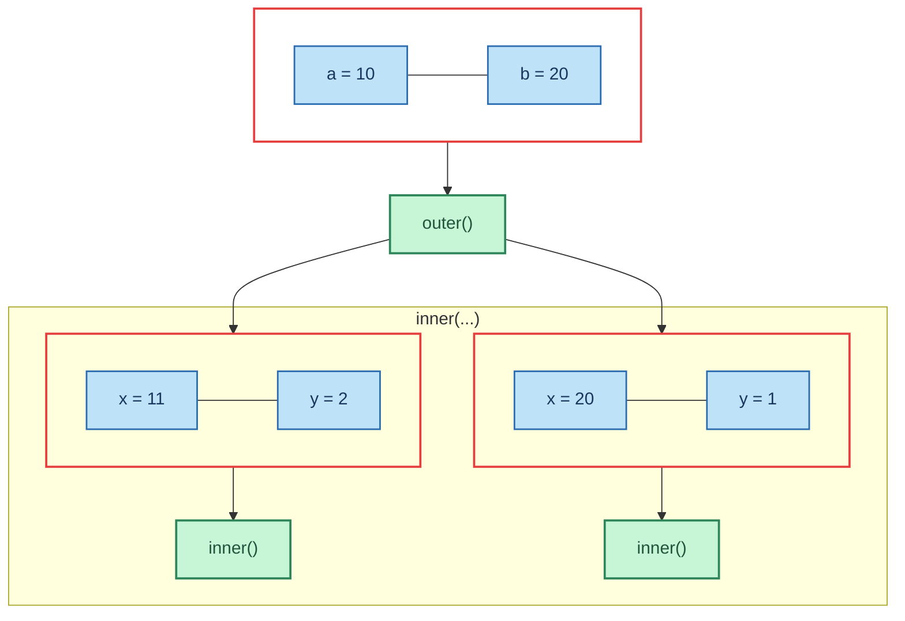

# Crustrace-Mermaid

[](./LICENSE)
[](https://crates.io/crates/crustrace-mermaid)
[](https://docs.rs/crustrace-mermaid)

**Crustrace-Mermaid** is a [`tracing-subscriber`](https://docs.rs/tracing-subscriber) layer that renders
[`crustrace`](https://crates.io/crates/crustrace) spans as [Mermaid](https://mermaid.js.org/) flowcharts.

Use it to **visualise function call graphs** directly in your terminal or export them into diagrams
for documentation, debugging, or presentations.

## Motivation

`crustrace` automatically instruments your functions with `tracing` spans.  
`crustrace-mermaid` takes those spans and **turns them into diagrams**:

- Functions become green boxes
- Parameters become blue boxes
- Each invocation groups its parameters into a red capsule
- Calls between functions become arrows in a call tree
- You can choose whether to merge identical function calls into a single subgraph using the `GroupingMode` enum (default: `MergeByName`)
  or keep each invocation distinct (`UniquePerCall`)

This makes call hierarchies easier to understand than scrolling log output.

## Installation

Add both `crustrace` and `crustrace-mermaid`:

```toml
[dependencies]
crustrace = "0.1"
crustrace-mermaid = "0.1"
tracing = "0.1"
tracing-subscriber = "0.3"
````

---

## Usage

### Example

```rust
use crustrace::instrument;
use crustrace_mermaid::{MermaidLayer, GroupingMode};
use tracing_subscriber::prelude::*;

#[instrument]
fn inner(x: i32, y: i32) -> i32 {
    x + y
}

#[instrument]
fn outer(a: i32, b: i32) -> i32 {
    let r1 = inner(a + 1, b / 10);
    let r2 = inner(a * 2, b / 20);
    r1 + r2
}

fn main() {
    // Attach the Mermaid layer
    tracing_subscriber::registry()
        .with(MermaidLayer::new())
        .init();

    outer(10, 20);
}
```

When run, this prints a **Mermaid flowchart definition**:



Paste this into a Markdown file, or render with [Mermaid Live Editor](https://mermaid.live/).

## Grouping Modes

* **`MergeByName` (default):**
  All calls to the same function are grouped together in a subgraph.

* **`UniquePerCall`:**
  Each invocation is drawn separately, even if the function name repeats.

---

## API

```rust
MermaidLayer::new();                                   // to stdout, auto-flush on drop
MermaidLayer::with_mode(GroupingMode::UniquePerCall);  // choose grouping style
MermaidLayer::new_to_file("trace.mmd");                // write to file
MermaidLayer::without_auto_flush();                    // manual flush via .flush()
```

---

## License

This project is licensed under either of:

* Apache License, Version 2.0, ([LICENSE-APACHE](../LICENSE-APACHE) or [http://www.apache.org/licenses/LICENSE-2.0](http://www.apache.org/licenses/LICENSE-2.0))
* MIT license ([LICENSE-MIT](../LICENSE-MIT) or [http://opensource.org/licenses/MIT](http://opensource.org/licenses/MIT))

at your option.
